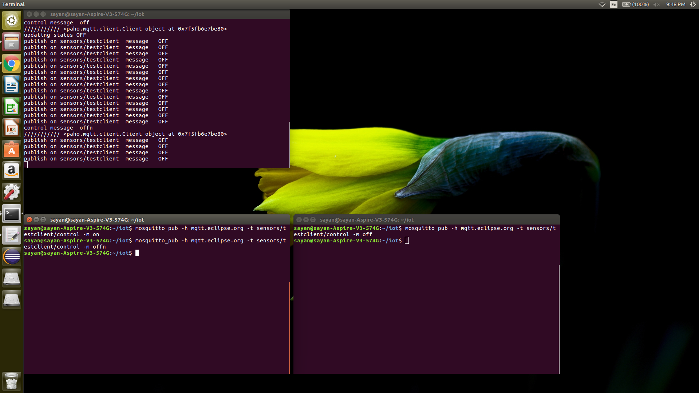

# IOT Final Project - Home Automation
### Contributers - Kamakshi jain and Sayan Brahma

## Dependencies:
```
sudo pip install paho-mqtt
sudo apt-get install mosquitto
```

## Run Instructions:
navigate to the saved project directory where you have the simple-sensor.py file, and open a new terminal and type the following command:
```
python3 simple-sensor.py -h mqtt.eclipse.org -n testclient -v -i2
```
Here mqtt.eclipse.org is the broker. This is the chatty mode where the status is published every 2 seconds. This instruction calls the light sensor. If you want to call the door sensor give the following command:
```
python3 simple-sensor.py -h mqtt.eclipse.org -n testclient -v -i3 -s
```
To change the states, open a new window by pressing ctrl+alt+t and give the following command.
```
mosquitto_pub -h mqtt.eclipse.org -t sensors/testclient/control -m <status>
```
status will be on/off for light or closed/open for door sensor.

## Light sensor and 1 client
Navigate to the directory containing simple-sensor.py file and open a terminal
```
python3 simple-sensor.py -h mqtt.eclipse.org -n testclient -v -i2
```
new terminal
```
mosquitto_pub -h mqtt.eclipse.org -t sensors/testclient/control -m on
```

## Light sensor and 2 clients
Navigate to the directory containing simple-sensor.py file and open a terminal
```
python3 simple-sensor.py -h mqtt.eclipse.org -n testclient -v -i2
```
new terminal
```
mosquitto_pub -h mqtt.eclipse.org -t sensors/testclient/control -m on
```
new terminal
```
mosquitto_pub -h mqtt.eclipse.org -t sensors/testclient/control -m off
```

## Light sensor + Door sensor + 1 clients each

Navigate to the directory containing simple-sensor.py file and open a terminal
```
python3 simple-sensor.py -h mqtt.eclipse.org -n testclient -v -i2
```
open a new terminal
```
python3 simple-sensor.py -h broker.hivemq.com -n testclient -v -i3 -s
```

open 2 new terminals and give the following commands in respective terminals.
```
mosquitto_pub -h mqtt.eclipse.org -t sensors/testclient/control -m on
```
```
mosquitto_pub -h broker.hivemq.com -t sensors/testclient/control -m closed
```
## Screen shots
### Light sensor and 1 client


### Light sensor and 2 clients


### Light sensor and 2 clients and an invalid status update


Here even if the client tries to change the status of the senors with an invalid state, a message will be published that the client has tried to change the state but the state wont be changed.

### Light sensor and door sensor with 1 client each

When different sensors are played with, it should be kept in mind that the broker is different for each sensor (as per our prokect).

